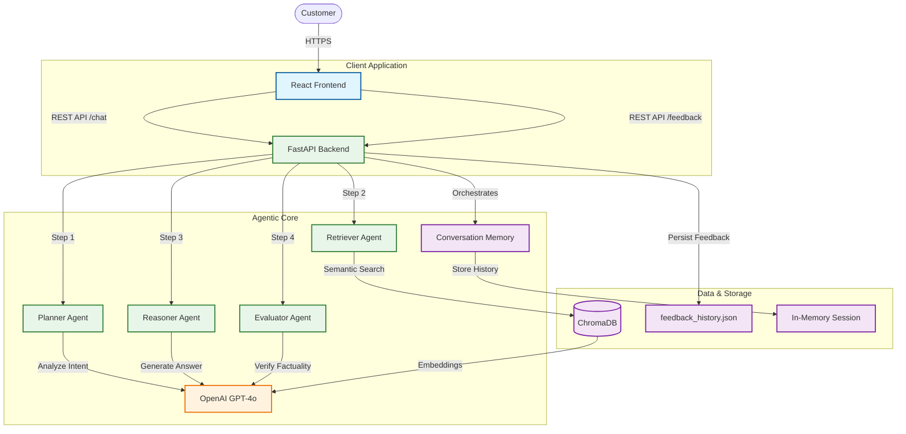

# British Airways Agentic Chatbot - System Architecture

## Overview
This document outlines the technical architecture of the British Airways Agentic Chatbot. The system is built as a microservices application using Docker, featuring a React frontend and a FastAPI backend that orchestrates a multi-agent AI system.

## High-Level Architecture

## Component Details

### 1. Frontend (React + Vite)
- **Role**: Provides the chat interface.
- **Features**: Glassmorphism UI, real-time typing indicators, markdown support, and an integrated feedback collection flow.
- **Communication**: Sends requests to the backend via REST `POST /chat`.

### 2. Backend (FastAPI)
- **Role**: Central orchestrator.
- **Agents**:
    - **Planner Agent**: Analyzes user intent (e.g., "Liquids" vs. "Baggage") and creates a search strategy.
    - **Retriever Agent**: Queries the `ChromaDB` vector store using OpenAI Embeddings to find relevant BA policies.
    - **Reasoner Agent**: Synthesizes the final answer using the relevant context and conversation history, ensuring politeness and accuracy.
    - **Evaluator Agent**: Self-corrects the output by verifying the generated answer against the retrieved sources before sending it to the user.

### 3. Data & Storage
- **ChromaDB**: Stores vector embeddings of British Airways policy documents for semantic search.
- **OpenAI**: Provides LLM capabilities (`gpt-4o-mini`) and Embeddings (`text-embedding-3-small`).
- **Feedback Loop**: User feedback (Satisfied/Not Satisfied) is logged to `feedback_history.json` for future offline learning and model fine-tuning.

## Docker Infrastructure
The entire system is containerized for easy deployment:
- **Frontend Container**: Nginx serving the React build.
- **Backend Container**: Python 3.10-slim running Uvicorn/FastAPI.
- **Networking**: Containers communicate via a private Docker bridge network.
